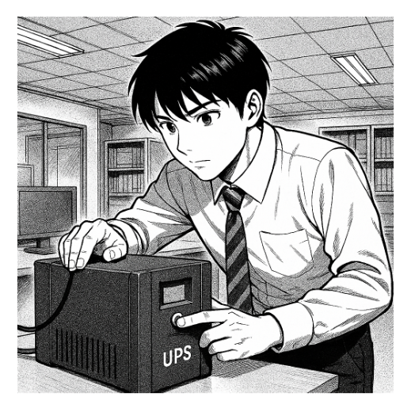

# ⚙️ Estudi i Tria d’un SAI per a TecnoGestió S.L.

## 🏢 Context

**L’empresa TecnoGestió S.L.**, dedicada a la **gestió documental** i **assessorament informàtic**, disposa d’un petit despatx amb:
- 4 ordinadors de sobretaula  
- 1 impressora-fotocopiadora multifunció (similar a les que té l’escola)  
- 1 router d’accés a Internet  

Davant les constants incidències amb el **subministrament elèctric** a la zona, la direcció ha decidit **adquirir un SAI (Sistema d’Alimentació Ininterrompuda)** per garantir la **continuïtat del servei** i **protegir els equips**.

L’empresa ha contactat amb **EverPia**, on esteu realitzant la vostra estada, i el vostre responsable us ha encarregat fer l’**estudi i tria del SAI adequat**.

---

## 🧩 Tasques a Realitzar

### 1. 🖥️ Inventari d’Equips
- Elaborar una **llista dels dispositius** que es connectaran al SAI (ordinadors, monitors, router, etc.).  
- **Justificar** si hi ha algun aparell que **no** s’hauria de connectar al sistema d’alimentació ininterrompuda.  
- Consultar les **especificacions tècniques** per obtenir el **consum** de cada dispositiu.  
- Seleccionar components **similars als del client** i indicar clarament:  
  - Nom del component  
  - Potència en **Watts (W)**  
  - Potència en **Voltamperes (VA)**  

---

### 2. ⚡ Càlcul de Potència Total
- Calcular el **valor total de potència** necessària.  
- Afegir una **reserva del 20%** per garantir seguretat i estabilitat.

---

### 3. ⏱️ Determinació de l’Autonomia
- Estimar el **temps mínim d’autonomia** que el SAI ha de mantenir els equips en funcionament.  
  *(Per exemple: 10 minuts per guardar treballs i apagar correctament els ordinadors.)*

---

### 4. 🔍 Recerca de Models de SAI
- Buscar **2 o 3 models** de SAI que compleixin els requisits calculats.  
- Fer una **comparació de característiques**:
  - Potència total  
  - Autonomia  
  - Tipus de sortides  
  - Preu  
  - Marca / fabricant  

---

### 5. 🧾 Informe Tècnic
Redactar un **informe tècnic complet** amb:
- Càlculs realitzats  
- Models de SAI analitzats  
- **Justificació** de la **selecció final**

---

## 🧠 Objectiu

L’objectiu d’aquesta tasca és aprendre a **avaluar les necessitats energètiques d’una organització**, a **dimensionar un SAI adequadament** i a **redactar un informe tècnic professional** amb criteri i rigor.

---

