2n  -  GM  Sistemes  microinformàtics 
xarxes  B  Seguretat 
(Classe) - 25-26 
i 
informàtica  (B)  

El primer que farem després de reiniciar la màquina és prémer Ctrl + qualsevol tecla durant l’arrencada per accedir al menú d’inici. Un cop aparegui el menú, seleccionarem l’opció Advanced options per poder accedir a les opcions avançades del sistema.

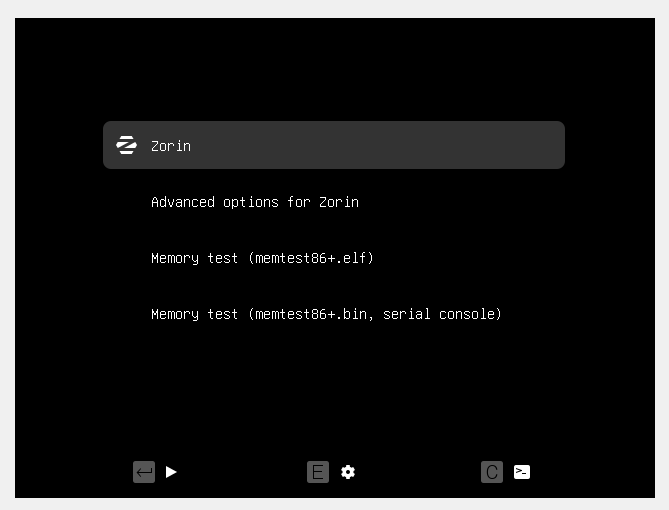

Després, dins del menú d’Advanced options, seleccionarem la segona opció, anomenada Recovery mode. Aquesta opció ens permet iniciar el sistema en un entorn especial de recuperació, des d’on podrem fer tasques de manteniment, reparació o configuració avançada sense iniciar completament el sistema operatiu. 
 
 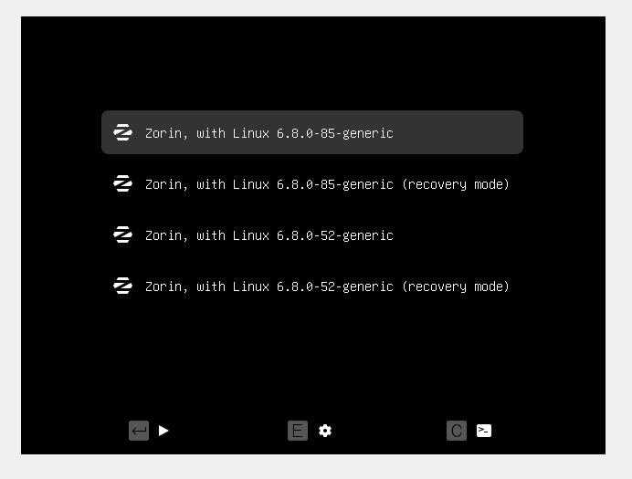
 
 Li donarem a l'opció root. 

  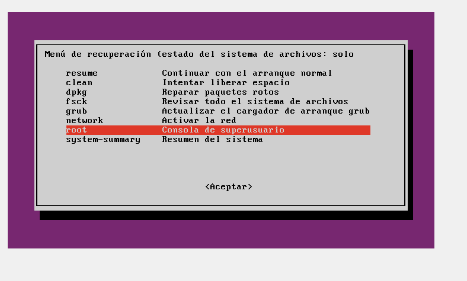
 
Un cop dins del Recovery mode, farem servir l’ordre cat per llegir el contingut de l’arxiu que ens interessa i comprovar què hi ha dins. Després, podem utilitzar grep per filtrar la informació segons el nom o el patró que vulguem buscar dins del fitxer, facilitant així la localització de les dades específiques que necessitem.


  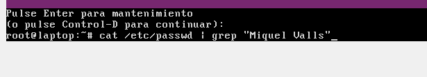

  Aquí podem canviar la contrasenya amb passwd i el nom miquel.

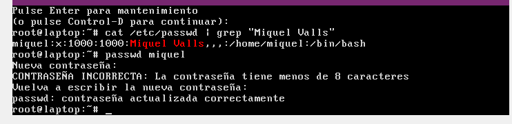

Un cop puguem accedir a la màquina amb la nova contrasenya, obrirem una terminal i executarem: grub-mkpasswd-pbkdf2 | tee salida.txt. Aquesta comanda generarà el hash de la contrasenya i el desarà al fitxer salida.txt, a més de mostrar-lo per pantalla. Guarda aquest valor, ja que el farem servir més endavant per configurar el GRUB.

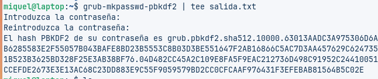

Després, amb un editor de text, obrirem el fitxer salida.txt per copiar la part del hash que hem generat, ja que l’haurem de fer servir més endavant a la configuració del GRUB.

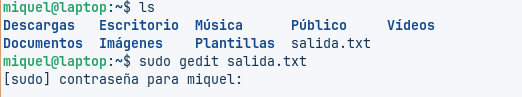

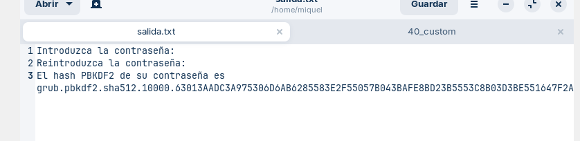

A continuació, obrirem també el fitxer /etc/grub.d/40_custom amb un editor de text. A dins, afegirem les dues línies següents: una per definir l’usuari amb set superusers i una altra amb password, on enganxarem el hash que hem copiat anteriorment.

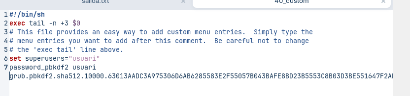

Per guardar farem el sudo grub-mkconfig -o /boot/grub/grub.cfg.

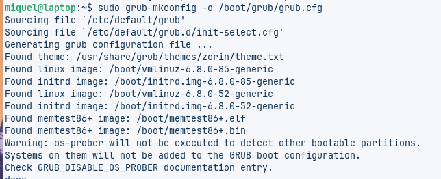

I ens sortirà això cada vegada que iniciem la maquina.

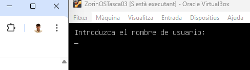

https://waytoit.wordpress.com/2019/09/15/protegiendo-grub-en-ubuntu-server/ 

- [Torna al enunciat](README.md)

